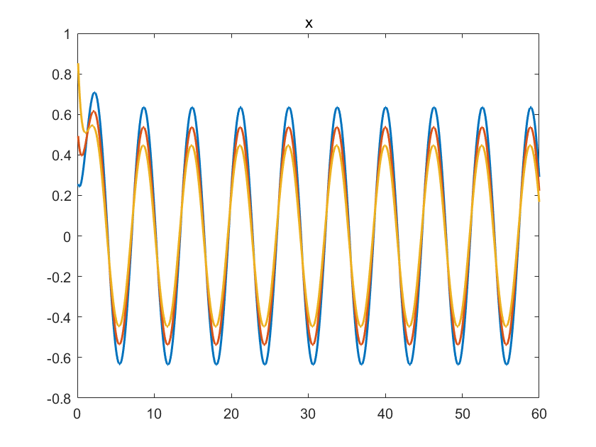
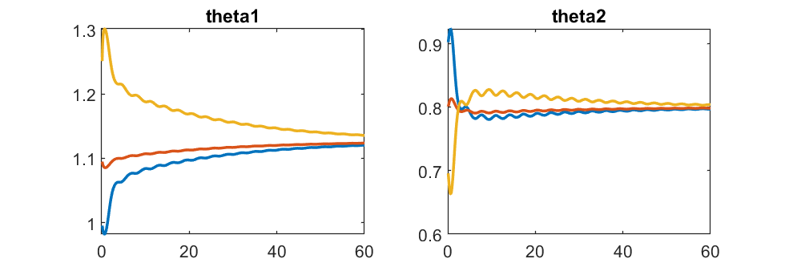

We consider a multi-agent system given by

$$\dot x_i = [-x_i, \sin(t)] \; \theta_i + k \textstyle{\sum_{j \in N_i}} (x_j - x_i)$$

where $\theta_i \in R^2$.
With each component of $\theta_i(0)$ varying within $[a,b]$ ($b>a>0$), both components of 

$$\theta_0^* = (1/N) \sum_{i=1}^N \theta_i(0) =: [\alpha,\beta]^T$$

are positive.
Then, it is straightforward to see that Assumptions 3 and 4 in the paper hold. 
Assumption 1 is also verified because equation (6) becomes 

$$\dot {\hat s} = -\alpha \hat s + \beta \sin(t)$$ 

and thus, $\hat s(t)$ tends to $A \sin(t + \gamma)$ with $A>0$ and $\gamma \not = 0$.

### Simulation

Number of agents N = 3.
Graph is the ring graph.
Coupling gain k = 1.

Initial states $x(0) = [x_1(0), x_2(0), x_3(0)]^T$ is taken as
x0 = rand(N,1);

And the initial $\theta_i(0)$ is taken as

$\theta_1(0) = [1, 0.9]^T$, $\theta_2(0) = [1.1, 0.8]^T$, $\theta_3(0) = [1.2, 0.7]^T$

#### When there is no coupling

#### When there is coupling with no adaptation

#### When there is coupling and adaptation

And, the progress of parameters

